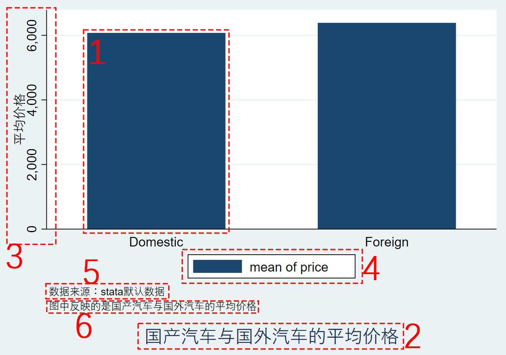
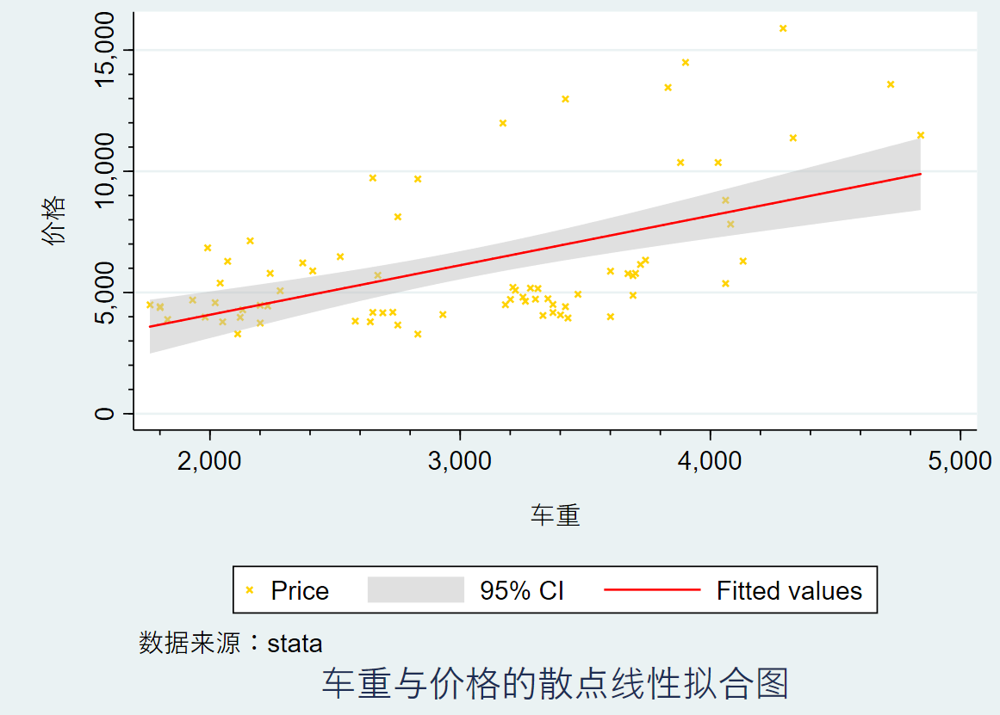

# 目录
## <a href='#chapter2'>chapter2 数据文件建立和管理</a>
   * ### <a href='#2.1'>2.1 文件读取、导入、保存</a>
       * ### <a href='#2.1.1'>2.1.1 文件读取</a>
       * ### <a href='#2.1.2'>2.1.2 文件导入</a>
           - ### <a href='#2.1.2-1'>2.1.2-1 Excel文件</a>
           - ### <a href='#2.1.2-2'>2.1.2-2 纯文本文件（txt、raw、csv）</a>
       * ### <a href='#2.1.3'>2.1.3 文件保存</a>
       * ### <a href='#2.1.4'>2.1.4 文件导出</a>
           - ### <a href='#2.1.4-1'>2.1.2-1 Excel文件</a>
           - ### <a href='#2.1.4-2'>2.1.2-2 纯文本文件</a>
   * ### <a href='#2.2'>2.2 数据查、增、删、改</a>
       * ### <a href='#2.2.1'>2.2.1 数据查询</a>
           - ### <a href='#2.2.1-1'>2.2.1-1 数据查询列表</a>
           - ### <a href='#2.2.1-2'>2.2.1-2 数据属性查询</a>
           - ### <a href='#2.2.1-3'>2.2.1-3 数据排序</a>
       * ### <a href='#2.2.2'>2.2.2 数据增加</a>
           - ### <a href='#2.2.2-1'>2.2.2-1 数据输入增加</a>
           - ### <a href='#2.2.2-2'>2.2.2-2 新建变量</a>
       * ### <a href='#2.2.3'>2.2.3 数据删除与保留</a>
           - ### <a href='#2.2.3-1'>2.2.3-1 数据删除</a>
           - ### <a href='#2.2.3-2'>2.2.3-2 数据保留</a>
       * ### <a href='#2.2.4'>2.2.4 数据更改</a>
           - ### <a href='#2.2.4-1'>2.2.4-1 变量名更改</a>
           - ### <a href='#2.2.4-2'>2.2.4-2 值更改</a>
           - ### <a href='#2.2.4-3'>2.2.4-3 标签更改</a>
           - ### <a href='#2.2.4-4'>2.2.4-4 值标签更改</a>
           - ### <a href='#2.2.4-5'>2.2.4-5 将变量分类</a>
           - ### <a href='#2.2.4-6'>2.2.4-6 数据类型更改</a>
           - ### <a href='#2.2.4-7'>2.2.4-7 字符串型变量与数值型变量间的互换</a>
               - #### <a href='#2.2.4-7.1'>2.2.4-7.1 encode与decode</a>
               - #### <a href='#2.2.4-7.2'>2.2.4-7.2 destring与tostring</a>
## <a href='#chapter3'>chapter3 数据统计描述（初级篇）</a>
   * ### <a href='#3.1'>3.1 基本统计量</a>  
       * ### <a href='#3.1.1'>3.1.1 基本描述统计指标</a>  
       * ### <a href='#3.1.2'>3.1.2 生成统计表格</a>  
       * ### <a href='#3.1.3'>3.1.3 描述数据内容</a>  
   * ### <a href='#3.2'>3.2 列联表及其描述统计</a>  
       * ### <a href='#3.2.1'>3.2.1 对单一变量做频数分析</a>  
       * ### <a href='#3.2.2'>3.2.2 对单一变量做描述性统计分析</a>  
       * ### <a href='#3.2.3'>3.2.3 列联表</a>  
## <a href='#chapter4'>chapter4 统计图绘制（初级篇）</a>
   * ### <a href='#4.1'>4.1 统计图简介</a>  
       * ### <a href='#4.1.1'>4.1.1 统计图的构成要素</a>  
       * ### <a href='#4.1.2'>4.1.2 统计图的分类</a>  
   * ### <a href='#4.2'>4.2 统计图生成</a>  
       * ### <a href='#4.2.1'>4.2.1 柱状图</a>  
       * ### <a href='#4.2.2'>4.2.2 饼图</a>  
       * ### <a href='#4.2.3'>4.2.3 二维图</a>  

 

***  
 

# <a id='chapter2'>chapter2 数据文件建立和管理</a>
## <a id='2.1'>2.1 文件读取、导入、保存</a>
### <a id='2.1.1'>2.1.1 文件读取</a>
`use [var] [if] [in] using filename [,clear nolabel]`  
*use 命令若文件无扩展名，则默认读取.dat文件*
可选参数 | 作用
------- | --------
nolabel | 清除数据中的变量的值的标签
clear | 清除程序已读数据  

### <a id='2.1.2'>2.1.2 文件导入</a>
##### <a id='2.1.2-1'>2.1.2-1 Excel文件</a>
*导入整个Excel*  
`import excel [using] filename [,import_excel_options]`

*导入Excel的部分变量*  
`import excel extvarlist using filename [, import_excel_options]`
可选参数 | 作用
------- | --------
sheet("sheetname") | 选取工作簿
cellrange([start][:end]) | 选取单元格
firstrow | 将第一行视为变量名

##### <a id='2.1.2-2'>2.1.2-2 纯文本文件（txt、raw、csv）</a>
`import delimited [using] filename [, import_delimited_options]`
可选参数 | 作用
------- | --------
delimiters("chars") | 指定分隔符  

`insheet [varlist] using filename [, options]`  
*insheet 命令被 import delimited 命令取代，虽 insheet 命令仍然继续工作，但从STATA 13开始，insheet 不再是官方的一部分*
可选参数 | 作用
------- | --------
tab | 指定tab进行分隔
comma | 指定英文逗号进行分隔  
delimiters("chars") | 指定分隔符
  
### <a id='2.1.3'>2.1.3 文件保存</a>
`save [filename] [, save_options]`
可选参数 | 作用
------- | --------
replace | 覆盖原有数据
orphans | 保存所有值标签  
  
### <a id='2.1.4'>2.1.4 文件导出</a>
##### <a id='2.1.4-1'>2.1.4-1 Excel文件</a>
`export excel [using] filename [if] [in] [, export_excel_options]`
##### <a id='2.1.4-2'>2.1.4-2 纯文本文件</a>
`outfile [varlist] using filename [if] [in] [, options]`

## <a id='2.2'>2.2 数据查、增、删、改</a>
### <a id='2.2.1'>2.2.1 数据查询</a>
##### <a id='2.2.1-1'>2.2.1-1 数据查询列表</a>
`list [varlist] [if] [in] [, options]`
##### <a id='2.2.1-2'>2.2.1-2 数据属性查询</a>
`describe [varlist], [simple/short]`  
`describe [varlist] using filename, [simple/short]`
##### <a id='2.2.1-3'>2.2.1-3 数据排序</a>
`gsort [-] varname [[-] varname …] [, generate (newvar) mfirst]`
  
### <a id='2.2.2'>2.2.2 数据增加</a>
##### <a id='2.2.2-1'>2.2.2-1 数据输入增加</a>
`input [var1] [var2] ...`  
`[var1_value1] [var2_value1] ...`  
`[var1_value2] [var2_value2] ...`  
`... ... ...`  
`end`  
*适合小样本数据*
##### <a id='2.2.2-2'>2.2.2-2 新建变量</a>
`generate [type] newvar=exp [if] [in]`  
*exp为新变量生成的规则，数学表达式*
  
### <a id='2.2.3'>2.2.3 数据删除与保留</a>
##### <a id='2.2.3-1'>2.2.3-1 数据删除</a>
`drop varlist`
##### <a id='2.2.3-2'>2.2.3-2 数据保留</a>
`keep varlist`
  
### <a id='2.2.4'>2.2.4 数据更改</a>
##### <a id='2.2.4-1'>2.2.4-1 变量名更改</a>
`rename old_var new_var`  
`rename (old1 old2 ...) (new1 new2 ...)`  
*t\*代表以t开头的变量*
##### <a id='2.2.4-2'>2.2.4-2 值更改</a>
`replace oldvar=exp [if] [in] [, nopromote]`
##### <a id='2.2.4-3'>2.2.4-3 标签更改</a>
*定义数据标签*  
`label data "label"`  
*定义变量标签*  
`label var varname "label"`
##### <a id='2.2.4-4'>2.2.4-4 值标签更改</a>
*定义值变量标签*  
`label define lblname # "label" [# "label" ...] [, add modify replace nofix]`  
*将值标签指定到分类变量上*  
`label values varlist [lblname|.] [, nofix]`  
*删除值标签*  
`label drop {lblname [lblname ...] | _all}`
##### <a id='2.2.4-5'>2.2.4-5 将变量分类</a>
`recode varlist (rule) [(rule) ...] [, generate(newvar)]`  
*示例：`recode leng (142/170 = 1 "A级车") (171/204 = 2 "B级车") (205/233 = 3 "C级车") ,generate(lengtype)`*
##### <a id='2.2.4-6'>2.2.4-6 数据类型更改</a>
`format varlist %fmt`  

整数数据类型  
数据类型 | 含义 | 范围   
------- | -------- | -------   
byte | 字节型 | (-100,+100)  
int | 一般整数型 | (-32000,+32000)  
long | 长整型 | (-2.14\*10^10, +2.14\*10^10) 
  
小数数据类型  
数据类型 | 含义 | 精度  
------- | -------- | -------  
float | 浮点型 | 8位有效数字  
double | 双精度型 | 16位有效数字  
  
字符串数据类型  
数据类型 | 含义 | 大小  
------- | -------- | -------  
str | 字符串型 | # 
  
##### <a id='2.2.4-7'>2.2.4-7 字符串型变量与数值型变量间的互换</a>
###### <a id='2.2.4-7.1'>2.2.4-7.1 encode与decode</a>
*字符串——>数值*  
`encode varname [if] [in], generate(newvar) [label (name) noextend]`  
*数值——>字符串*  
`decode varname [if] [in], generate(newvar) [maxlength(#)]`  
###### <a id='2.2.4-7.2'>2.2.4-7.2 destring与tostring</a>
*字符串——>数值*  
`destring [varlist] , {generate(newvarlist)|replace} [destring_options]`  
*数值——>字符串*  
`tostring varlist , {generate(newvarlist)|replace} [tostring_options]`  

 

***
 

# <a id='chapter3'>chapter3 数据统计描述（初级篇）</a>
## <a id='3.1'>3.1 基本统计量</a>
### <a id='3.1.1'>3.1.1 基本描述统计指标</a>
`summarize [varlist] [if] [in] [weight] [, options]`  
可选参数 | 作用
------- | --------
detail | 追加更多统计指标  

*例：*  
> · `use auto`  
> (1978 Automobile Data) 
>  
> · `summarize price ,detail`  
> &nbsp;&nbsp;&nbsp;&nbsp;&nbsp;&nbsp;&nbsp;&nbsp;&nbsp;&nbsp;&nbsp;&nbsp;&nbsp;&nbsp;&nbsp;&nbsp;&nbsp;&nbsp;&nbsp;&nbsp;&nbsp;&nbsp;&nbsp;&nbsp;&nbsp;&nbsp;&nbsp;&nbsp;&nbsp;&nbsp;&nbsp;&nbsp;&nbsp; Price  
> \----------------------------------------------------------------  
> &nbsp;&nbsp;&nbsp;&nbsp;&nbsp;&nbsp;&nbsp;&nbsp; Percentiles &nbsp;&nbsp;&nbsp;&nbsp;&nbsp;&nbsp;&nbsp; Smallest  
>  1% &nbsp;&nbsp;&nbsp;&nbsp;&nbsp;&nbsp;&nbsp; 3291 &nbsp;&nbsp;&nbsp;&nbsp;&nbsp;&nbsp;&nbsp;&nbsp;&nbsp;&nbsp;&nbsp;&nbsp; 3291  
>  5% &nbsp;&nbsp;&nbsp;&nbsp;&nbsp;&nbsp;&nbsp; 3748 &nbsp;&nbsp;&nbsp;&nbsp;&nbsp;&nbsp;&nbsp;&nbsp;&nbsp;&nbsp;&nbsp;&nbsp; 3299  
> 10% &nbsp;&nbsp;&nbsp;&nbsp;&nbsp; 3895 &nbsp;&nbsp;&nbsp;&nbsp;&nbsp;&nbsp;&nbsp;&nbsp;&nbsp;&nbsp;&nbsp;&nbsp; 3667 &nbsp;&nbsp;&nbsp;&nbsp;&nbsp;&nbsp; Obs &nbsp;&nbsp;&nbsp;&nbsp;&nbsp;&nbsp;&nbsp;&nbsp;&nbsp;&nbsp;&nbsp;&nbsp;&nbsp;&nbsp;&nbsp; 74  
> 25% &nbsp;&nbsp;&nbsp;&nbsp;&nbsp; 4195 &nbsp;&nbsp;&nbsp;&nbsp;&nbsp;&nbsp;&nbsp;&nbsp;&nbsp;&nbsp;&nbsp;&nbsp; 3748 &nbsp;&nbsp;&nbsp;&nbsp;&nbsp;&nbsp; Sum of Wgt. &nbsp;&nbsp;&nbsp; 74  
>
> 50% &nbsp;&nbsp;&nbsp;&nbsp;&nbsp; 5006.5 &nbsp;&nbsp;&nbsp;&nbsp;&nbsp;&nbsp;&nbsp;&nbsp;&nbsp;&nbsp;&nbsp;&nbsp;&nbsp;&nbsp;&nbsp;&nbsp;&nbsp;&nbsp;&nbsp;&nbsp;&nbsp;&nbsp;&nbsp;&nbsp; Mean &nbsp;&nbsp;&nbsp;&nbsp;&nbsp;&nbsp;&nbsp;&nbsp;&nbsp;&nbsp;&nbsp;&nbsp;&nbsp; 6165.257  
> &nbsp;&nbsp;&nbsp;&nbsp;&nbsp;&nbsp;&nbsp;&nbsp;&nbsp;&nbsp;&nbsp;&nbsp;&nbsp;&nbsp;&nbsp;&nbsp;&nbsp;&nbsp;&nbsp;&nbsp;&nbsp;&nbsp;&nbsp;&nbsp;&nbsp;&nbsp;&nbsp;&nbsp;&nbsp;&nbsp;&nbsp;&nbsp; Largest &nbsp;&nbsp;&nbsp; Std. Dev. &nbsp;&nbsp;&nbsp;&nbsp;&nbsp;&nbsp;&nbsp;&nbsp; 2949.496  
> 75% &nbsp;&nbsp;&nbsp;&nbsp;&nbsp; 6342 &nbsp;&nbsp;&nbsp;&nbsp;&nbsp;&nbsp;&nbsp;&nbsp;&nbsp;&nbsp;&nbsp;&nbsp; 13466  
> 90% &nbsp;&nbsp;&nbsp;&nbsp;&nbsp; 11385 &nbsp;&nbsp;&nbsp;&nbsp;&nbsp;&nbsp;&nbsp;&nbsp;&nbsp;&nbsp; 13594 &nbsp;&nbsp;&nbsp;&nbsp; Variance &nbsp;&nbsp;&nbsp;&nbsp;&nbsp;&nbsp;&nbsp;&nbsp;&nbsp; 8699526  
> 95% &nbsp;&nbsp;&nbsp;&nbsp;&nbsp; 13466 &nbsp;&nbsp;&nbsp;&nbsp;&nbsp;&nbsp;&nbsp;&nbsp;&nbsp;&nbsp; 14500 &nbsp;&nbsp;&nbsp;&nbsp; Skewness &nbsp;&nbsp;&nbsp;&nbsp;&nbsp;&nbsp;&nbsp; 1.653434  
> 99% &nbsp;&nbsp;&nbsp;&nbsp;&nbsp; 15906 &nbsp;&nbsp;&nbsp;&nbsp;&nbsp;&nbsp;&nbsp;&nbsp;&nbsp;&nbsp; 15906 &nbsp;&nbsp;&nbsp;&nbsp; Kurtosis &nbsp;&nbsp;&nbsp;&nbsp;&nbsp;&nbsp;&nbsp;&nbsp;&nbsp; 4.819188  

统计指标 | 描述
------- | --------
Obs | 样本观测总数  
Sum of Wgt. | 权重和  
Mean | 平均值  
Median | 中位数  
Mode | 众数  
Std. Dev. | 标准差  
Std. Err. | 标准误  
Variance | 方差  
Skewness | （正态）偏度  
Kurtosis | （正态）峰度  
  
### <a id='3.1.2'>3.1.2 生成统计表格</a>
`tabstat varlist [if] [in] [weight] [, options]`  
可选参数 | 作用
------- | --------
statistics(statname [...]) | 指定统计指标（默认为均值）  

*例：*  
> · `use auto`  
> (1978 Automobile Data)  
> 
> · `tabstat price ,statistics(variance)`  
> &nbsp;&nbsp; variable &nbsp;&nbsp;&nbsp;| variance  
> \-------------+----------  
> &nbsp;&nbsp;&nbsp;&nbsp;&nbsp;&nbsp; price &nbsp;&nbsp; | 8699526  
> \------------------------  
  
### <a id='3.1.3'>3.1.3 描述数据内容</a>
`codebook [varlist] [if] [in] [, options]`  
`inspect [varlist] [if] [in]`  
*inspect 命令会比 codebook 命令多绘制出一份纯文本的直方图*
  
## <a id='3.2'>3.2 列联表及其描述统计</a>
### <a id='3.2.1'>3.2.1 对单一变量做频数分析</a>
`tabulate varname [if] [in] [weight] [, tabulate1_options]`  
*例：*  
> · `use auto`  
> (1978 Automobile Data)  
> 
> · `tabulate price`  
> &nbsp;&nbsp;&nbsp;&nbsp; Price &nbsp;&nbsp;&nbsp; | &nbsp;&nbsp;&nbsp; Freq. &nbsp;&nbsp;&nbsp; Percent &nbsp;&nbsp;&nbsp; Cum.  
> \------------+-----------------------------------  
> &nbsp;&nbsp;&nbsp; 3,291 &nbsp;&nbsp;&nbsp; | &nbsp;&nbsp;&nbsp;&nbsp;&nbsp; 1 &nbsp;&nbsp;&nbsp;&nbsp;&nbsp;&nbsp;&nbsp;&nbsp;&nbsp; 1.35 &nbsp;&nbsp;&nbsp;&nbsp;&nbsp;&nbsp; 1.35  
> &nbsp;&nbsp;&nbsp; 3,299 &nbsp;&nbsp;&nbsp; | &nbsp;&nbsp;&nbsp;&nbsp;&nbsp; 1 &nbsp;&nbsp;&nbsp;&nbsp;&nbsp;&nbsp;&nbsp;&nbsp;&nbsp; 1.35 &nbsp;&nbsp;&nbsp;&nbsp;&nbsp;&nbsp; 2.70  
> &nbsp;&nbsp;&nbsp; ........... &nbsp;&nbsp;&nbsp; | &nbsp;&nbsp;&nbsp;&nbsp;&nbsp; ... &nbsp;&nbsp;&nbsp;&nbsp;&nbsp;&nbsp;&nbsp;&nbsp;&nbsp;&nbsp;&nbsp; ... &nbsp;&nbsp;&nbsp;&nbsp;&nbsp;&nbsp;&nbsp;&nbsp;&nbsp; ...  
> &nbsp;&nbsp;&nbsp; 15,906 &nbsp; | &nbsp;&nbsp;&nbsp;&nbsp;&nbsp; 1 &nbsp;&nbsp;&nbsp;&nbsp;&nbsp;&nbsp;&nbsp;&nbsp;&nbsp; 1.35 &nbsp;&nbsp;&nbsp;&nbsp;&nbsp;&nbsp; 100.00  
> \------------+-----------------------------------  
> &nbsp;&nbsp;&nbsp; Total &nbsp;&nbsp;&nbsp;&nbsp; | &nbsp;&nbsp;&nbsp;&nbsp; 74 &nbsp;&nbsp;&nbsp;&nbsp;&nbsp;&nbsp;&nbsp; 100.00  
> 
> · `tabulate foreign`  
>
> &nbsp;&nbsp;&nbsp; Car type &nbsp;&nbsp;&nbsp; | &nbsp;&nbsp; Freq. &nbsp;&nbsp;&nbsp;&nbsp; Percent &nbsp;&nbsp;&nbsp;&nbsp; Cum.  
> \---------------+----------------------------------  
> &nbsp;&nbsp;&nbsp; Domestic &nbsp; | &nbsp;&nbsp;&nbsp;&nbsp; 52 &nbsp;&nbsp;&nbsp;&nbsp;&nbsp;&nbsp;&nbsp;&nbsp; 70.27 &nbsp;&nbsp;&nbsp;&nbsp;&nbsp; 70.27  
> &nbsp;&nbsp;&nbsp; Foreign &nbsp;&nbsp;&nbsp;&nbsp; | &nbsp;&nbsp;&nbsp;&nbsp; 22 &nbsp;&nbsp;&nbsp;&nbsp;&nbsp;&nbsp;&nbsp;&nbsp; 29.73 &nbsp;&nbsp;&nbsp;&nbsp;&nbsp; 100.00  
> \---------------+----------------------------------  
> &nbsp;&nbsp;&nbsp; Total &nbsp;&nbsp;&nbsp;&nbsp;&nbsp;&nbsp;&nbsp;&nbsp; | &nbsp;&nbsp;&nbsp;&nbsp; 74 &nbsp;&nbsp;&nbsp;&nbsp;&nbsp;&nbsp;&nbsp;&nbsp; 100.00  

### <a id='3.2.2'>3.2.2 对单一变量做描述性统计分析</a>  
`tabulate varname1 [varname2] [if] [in] [weight] [, options]`  
可选参数 | 作用
------- | --------
summarize(varname3) | 单个或两个分类变量的描述性统计
[no] means | （不）包含均值
[no] standard | （不）包含标准差  
[no] freq | （不）包含频数  
[no] obs | （不）包含观测值个数  

*例：*  
> · `use auto`  
> (1978 Automobile Data)  
>   
> · `tabulate foreign rep78, summarize(price) means`  
> &nbsp;&nbsp;&nbsp;&nbsp;&nbsp;&nbsp;&nbsp;&nbsp;&nbsp;&nbsp;&nbsp;&nbsp;&nbsp;&nbsp;&nbsp;&nbsp;&nbsp;&nbsp;&nbsp;&nbsp;&nbsp;&nbsp;&nbsp;&nbsp;&nbsp;&nbsp;&nbsp;&nbsp;&nbsp;&nbsp;&nbsp;&nbsp;&nbsp;&nbsp;&nbsp;&nbsp;&nbsp;&nbsp;&nbsp;&nbsp;&nbsp;&nbsp;&nbsp;&nbsp;&nbsp;&nbsp; Means of Price  
>   
> &nbsp;&nbsp;&nbsp;&nbsp;&nbsp;&nbsp;&nbsp;&nbsp;&nbsp;&nbsp;&nbsp;&nbsp;&nbsp;&nbsp;&nbsp;&nbsp;&nbsp; | &nbsp;&nbsp;&nbsp;&nbsp;&nbsp;&nbsp;&nbsp;&nbsp;&nbsp;&nbsp;&nbsp;&nbsp;&nbsp;&nbsp;&nbsp;&nbsp;&nbsp;&nbsp;&nbsp;&nbsp;&nbsp;&nbsp;&nbsp;&nbsp; Repair Record 1978  
> &nbsp; Car type &nbsp;&nbsp; | &nbsp;&nbsp;&nbsp;&nbsp;&nbsp;&nbsp; 1 &nbsp;&nbsp;&nbsp;&nbsp;&nbsp;&nbsp;&nbsp;&nbsp;&nbsp;&nbsp;&nbsp;&nbsp; 2 &nbsp;&nbsp;&nbsp;&nbsp;&nbsp;&nbsp;&nbsp;&nbsp;&nbsp;&nbsp;&nbsp;&nbsp;&nbsp;&nbsp;&nbsp; 3 &nbsp;&nbsp;&nbsp;&nbsp;&nbsp;&nbsp;&nbsp;&nbsp;&nbsp;&nbsp;&nbsp;&nbsp;&nbsp;&nbsp; 4 &nbsp;&nbsp;&nbsp;&nbsp;&nbsp;&nbsp;&nbsp;&nbsp;&nbsp;&nbsp;&nbsp;&nbsp;&nbsp; 5 &nbsp;&nbsp;&nbsp;&nbsp;&nbsp;&nbsp;&nbsp;&nbsp;&nbsp;&nbsp; | &nbsp; Total  
> -------------+-------------------------------------------------------------------+------------  
> &nbsp; Domestic &nbsp; | &nbsp;&nbsp; 4,564.5 &nbsp;&nbsp; 5,967.625 &nbsp;&nbsp; 6,607.074 &nbsp;&nbsp; 5,881.556 &nbsp;&nbsp;&nbsp; 4,204.5 &nbsp;&nbsp;&nbsp;&nbsp;&nbsp; | &nbsp; 6,179.25  
> &nbsp; Foreign &nbsp;&nbsp;&nbsp;&nbsp; | &nbsp;&nbsp;&nbsp;&nbsp;&nbsp;&nbsp;&nbsp; . &nbsp;&nbsp;&nbsp;&nbsp;&nbsp;&nbsp;&nbsp;&nbsp;&nbsp;&nbsp;&nbsp;&nbsp; . &nbsp;&nbsp;&nbsp;&nbsp;&nbsp;&nbsp;&nbsp;&nbsp;&nbsp;&nbsp; 4,828.667 &nbsp;&nbsp; 6,261.444 &nbsp;&nbsp; 6,292.667 &nbsp;&nbsp; | &nbsp; 6,070.143  
> -------------+-------------------------------------------------------------------+------------  
> &nbsp; Total &nbsp;&nbsp;&nbsp;&nbsp;&nbsp;&nbsp;&nbsp;&nbsp; | &nbsp;&nbsp; 4,564.5 &nbsp;&nbsp; 5,967.625 &nbsp;&nbsp; 6,429.233 &nbsp;&nbsp;&nbsp;&nbsp; 6,071.5 &nbsp;&nbsp;&nbsp;&nbsp;&nbsp;&nbsp; 5,913 &nbsp;&nbsp;&nbsp;&nbsp;&nbsp;&nbsp; | &nbsp; 6,146.043  

### <a id='3.2.3'>3.2.3 列联表</a>
*列联表：考察两个分类变量的相关关系*  
语法1：`tabulate varname1 varname2 [if] [in] [weight] [, options]`  
语法2：`tab2 varlist [if] [in] [weight] [, options]`  
可选参数 | 作用
------- | --------
row | 按行在每个格内生成频率/比重  
col | 按列在每个格内生成频率/比重  
nofreq | 不显示频数  

*例：*
> · `use auto`  
> (1978 Automobile Data)  
> 
> · `tab2 foreign rep78 ,col nofreq`  
>   
> \-> tabulation of foreign by rep78  
>   
> &nbsp;&nbsp;&nbsp;&nbsp;&nbsp;&nbsp;&nbsp;&nbsp;&nbsp;&nbsp;&nbsp;&nbsp;&nbsp;&nbsp;&nbsp;&nbsp; | &nbsp;&nbsp;&nbsp;&nbsp;&nbsp;&nbsp;&nbsp;&nbsp;&nbsp;&nbsp;&nbsp;&nbsp;&nbsp;&nbsp;&nbsp;&nbsp; Repair Record 1978  
>  Car type &nbsp;&nbsp;&nbsp; | &nbsp;&nbsp;&nbsp;&nbsp;&nbsp; 1 &nbsp;&nbsp;&nbsp;&nbsp;&nbsp;&nbsp;&nbsp;&nbsp;&nbsp;&nbsp; 2 &nbsp;&nbsp;&nbsp;&nbsp;&nbsp;&nbsp;&nbsp;&nbsp;&nbsp; 3 &nbsp;&nbsp;&nbsp;&nbsp;&nbsp;&nbsp;&nbsp;&nbsp; 4 &nbsp;&nbsp;&nbsp;&nbsp;&nbsp;&nbsp;&nbsp;&nbsp; 5 &nbsp;&nbsp;&nbsp;&nbsp;&nbsp; | &nbsp;&nbsp; Total  
> ------------+-------------------------------------------------+----------  
>  Domestic &nbsp; | &nbsp;&nbsp; 100.00 &nbsp;&nbsp; 100.00 &nbsp;&nbsp; 90.00 &nbsp;&nbsp; 50.00 &nbsp;&nbsp; 18.18 &nbsp;&nbsp; | &nbsp;&nbsp; 69.57   
>  Foreign &nbsp;&nbsp;&nbsp;&nbsp; | &nbsp;&nbsp; 0.00 &nbsp;&nbsp;&nbsp;&nbsp;&nbsp;&nbsp; 0.00 &nbsp;&nbsp;&nbsp;&nbsp;&nbsp; 10.00 &nbsp;&nbsp; 50.00 &nbsp;&nbsp; 81.82 &nbsp;&nbsp; | &nbsp;&nbsp; 30.43   
> ------------+-------------------------------------------------+----------  
>  Total &nbsp;&nbsp;&nbsp;&nbsp;&nbsp;&nbsp;&nbsp;&nbsp; | &nbsp; 100.00 &nbsp; 100.00 &nbsp;&nbsp; 100.00 &nbsp; 100.00 &nbsp; 100.00 &nbsp; | &nbsp;&nbsp; 100.00   

 

***
 

# <a id='chapter4'>chapter4 统计图绘制（初级篇）</a>
## <a id='4.1'>4.1 统计图简介</a>
### <a id='4.1.1'>4.1.1 统计图的构成要素</a>
一般的统计图由六项构成：
 1. 曲线 （构成统计图的点、线、面）
 2. 标题
 3. 坐标轴 （如果是双变量的统计图，则会有横纵坐标；如果是单变量的统计图，则有一个隐含的坐标轴）
 4. 图例  
 5. 脚注 （note）
 6. 插文 （caption）  
  
*例：*  
> · `use auto`  
> (1978 Automobile Data)  
>    
> · `graph bar (mean) price , ///`   
> `over(foreign) ///`  
> `ytitle(平均价格) ///`  
> `title(国产汽车与国外汽车的平均价格, position(6) margin(medium)) ///`  
> `caption(图中反映的是国产汽车与国外汽车的平均价格, size(small)) ///`  
> `note(数据来源：stata默认数据) legend(on position(6))`  

本例中的图形生成结果如下：  
  
其中，红色虚线框内的部分（已经标出数字）分别对应了上述的六项统计图构成要素。  

### <a id='4.1.2'>4.1.2 统计图的分类</a>
一般来说，统计图可以分成一维图、二维图、矩阵图、时序检验图这几类。
* 一维图  
   * 柱状图  bar
   * 箱型图  box
   * 饼图    pie
* 二维图
   * 散点图  scatter
   * 折线图  line
   * 区域图  area
   * 线性拟合图  lfit
   * 非线性拟合图  gfit
   * 直方图  histogram
   * 密度函数图  kdensity
   * 函数图  function
* 矩阵图
* 时序检验图
   * 自相关系数图  ac
   * 偏相关系数图  pac
   * 脉冲响应函数图  irf

## <a id='4.2'>4.2 统计图生成</a>
统计图的生成不会增加、更改、删除原数据，并且统计图类型多样，每一统计图根据需求的不同又会有不同的样式，因此建议使用图形窗口来生成统计图。  
### <a id='4.2.1'>4.2.1 柱状图</a>
`graph bar  yvars [if] [in] [weight] [, options]`  
`graph hbar yvars [if] [in] [weight] [, options]`  
### <a id='4.2.2'>4.2.2 饼图</a>
`graph pie varlist [if] [in] [weight] [, options]`  
`graph pie varname [if] [in] [weight], over(varname) [options]`
### <a id='4.2.3'>4.2.3 二维图</a>
`[graph] twoway plot [if] [in] [, twoway_options]`  

*例：*  
> · `use auto`  
> (1978 Automobile Data)  
>      
> · `twoway (scatter price weight, mcolor(gold) msymbol(smx)) (lfitci price weight, lcolor(red) fcolor(%50) alwidth(0)) , ///`   
> `ytitle(价格) ytitle(, margin(medium)) ymtick(##5) ///`  
> `xtitle(车重) xtitle(, margin(medium)) xlabel(#5) xmtick(##5) ///`   
> `title(车重与价格的散点线性拟合图, size(large) position(6)) ///`   
> `caption(数据来源：stata) ///`   
> `legend(on cols(3) position(6))`  
>   
>    

