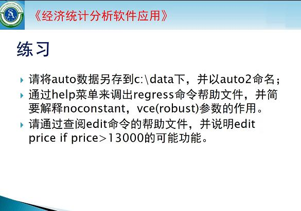
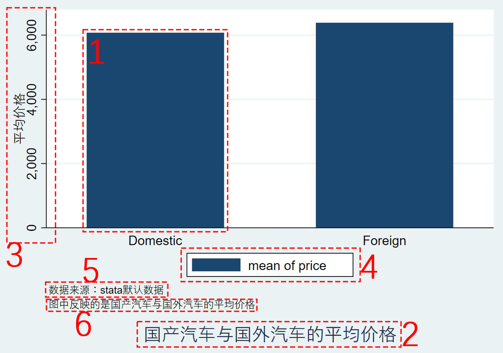
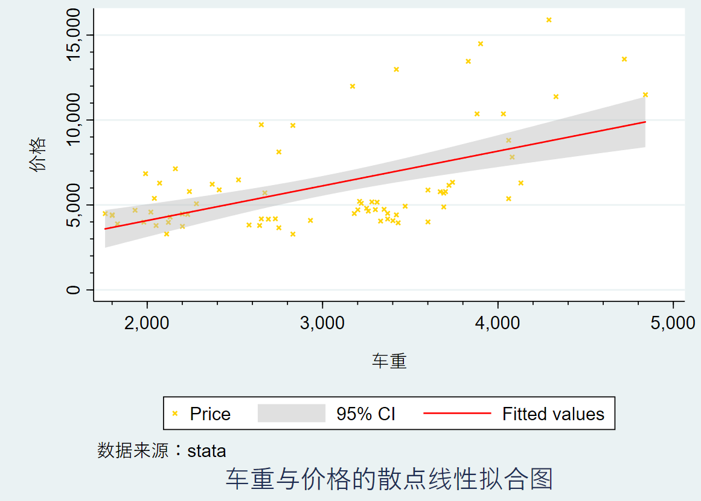
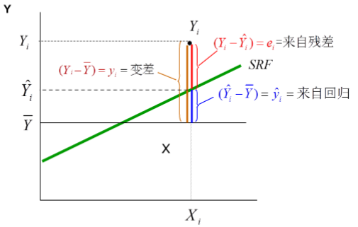
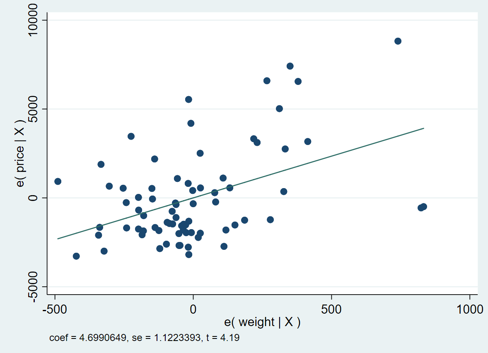

# <a id='cchapter1'>chapter1 STATA前言</a>
指令帮助：  
`help [command]`  
  
注释：  
`* command`  

多行续写：  
详情：`help delimit`

本节练习：  
  
<a href='https://github.com/WoziKing/stata_901090549/blob/master/demo1/demo-1.do'>练习参考</a>
 

***  
 

# <a id='cchapter2'>chapter2 数据文件建立和管理</a>
## <a id='c2.1'>2.1 文件读取、导入、保存</a>
### <a id='c2.1.1'>2.1.1 文件读取</a>
`use [var] [if] [in] using filename [,clear nolabel]`  
*use 命令若文件无扩展名，则默认读取.dat文件*
可选参数 | 作用
------- | --------
nolabel | 清除数据中的变量的值的标签
clear | 清除程序已读数据  

### <a id='c2.1.2'>2.1.2 文件导入</a>
##### <a id='c2.1.2-1'>2.1.2-1 Excel文件</a>
*导入整个Excel*  
`import excel [using] filename [,import_excel_options]`

*导入Excel的部分变量*  
`import excel extvarlist using filename [, import_excel_options]`
可选参数 | 作用
------- | --------
sheet("sheetname") | 选取工作簿
cellrange([start][:end]) | 选取单元格
firstrow | 将第一行视为变量名

##### <a id='c2.1.2-2'>2.1.2-2 纯文本文件（txt、raw、csv）</a>
`import delimited [using] filename [, import_delimited_options]`
可选参数 | 作用
------- | --------
delimiters("chars") | 指定分隔符  

`insheet [varlist] using filename [, options]`  
*insheet 命令被 import delimited 命令取代，虽 insheet 命令仍然继续工作，但从STATA 13开始，insheet 不再是官方的一部分*
可选参数 | 作用
------- | --------
tab | 指定tab进行分隔
comma | 指定英文逗号进行分隔  
delimiters("chars") | 指定分隔符
  
### <a id='c2.1.3'>2.1.3 文件保存</a>
`save [filename] [, save_options]`
可选参数 | 作用
------- | --------
replace | 覆盖原有数据
orphans | 保存所有值标签  
  
### <a id='c2.1.4'>2.1.4 文件导出</a>
##### <a id='c2.1.4-1'>2.1.4-1 Excel文件</a>
`export excel [using] filename [if] [in] [, export_excel_options]`
##### <a id='c2.1.4-2'>2.1.4-2 纯文本文件</a>
`outfile [varlist] using filename [if] [in] [, options]`

## <a id='c2.2'>2.2 数据查、增、删、改</a>
### <a id='c2.2.1'>2.2.1 数据查询</a>
##### <a id='c2.2.1-1'>2.2.1-1 数据查询列表</a>
`list [varlist] [if] [in] [, options]`
##### <a id='c2.2.1-2'>2.2.1-2 数据属性查询</a>
`describe [varlist], [simple/short]`  
`describe [varlist] using filename, [simple/short]`
##### <a id='c2.2.1-3'>2.2.1-3 数据排序</a>
`gsort [-] varname [[-] varname …] [, generate (newvar) mfirst]`
  
### <a id='c2.2.2'>2.2.2 数据增加</a>
##### <a id='c2.2.2-1'>2.2.2-1 数据输入增加</a>
`input [var1] [var2] ...`  
`[var1_value1] [var2_value1] ...`  
`[var1_value2] [var2_value2] ...`  
`... ... ...`  
`end`  
*适合小样本数据*
##### <a id='c2.2.2-2'>2.2.2-2 新建变量</a>
`generate [type] newvar=exp [if] [in]`  
*exp为新变量生成的规则，数学表达式*
  
### <a id='c2.2.3'>2.2.3 数据删除与保留</a>
##### <a id='c2.2.3-1'>2.2.3-1 数据删除</a>
`drop varlist`
##### <a id='c2.2.3-2'>2.2.3-2 数据保留</a>
`keep varlist`
  
### <a id='c2.2.4'>2.2.4 数据更改</a>
##### <a id='c2.2.4-1'>2.2.4-1 变量名更改</a>
`rename old_var new_var`  
`rename (old1 old2 ...) (new1 new2 ...)`  
*t\*代表以t开头的变量*
##### <a id='c2.2.4-2'>2.2.4-2 值更改</a>
`replace oldvar=exp [if] [in] [, nopromote]`
##### <a id='c2.2.4-3'>2.2.4-3 标签更改</a>
*定义数据标签*  
`label data "label"`  
*定义变量标签*  
`label var varname "label"`
##### <a id='c2.2.4-4'>2.2.4-4 值标签更改</a>
*定义值变量标签*  
`label define lblname # "label" [# "label" ...] [, add modify replace nofix]`  
*将值标签指定到分类变量上*  
`label values varlist [lblname|.] [, nofix]`  
*删除值标签*  
`label drop {lblname [lblname ...] | _all}`
##### <a id='c2.2.4-5'>2.2.4-5 将变量分类</a>
`recode varlist (rule) [(rule) ...] [, generate(newvar)]`  
*示例：`recode leng (142/170 = 1 "A级车") (171/204 = 2 "B级车") (205/233 = 3 "C级车") ,generate(lengtype)`*
##### <a id='c2.2.4-6'>2.2.4-6 数据类型更改</a>
`format varlist %fmt`  

整数数据类型  
数据类型 | 含义 | 范围   
------- | -------- | -------   
byte | 字节型 | (-100,+100)  
int | 一般整数型 | (-32000,+32000)  
long | 长整型 | (-2.14\*10^10, +2.14\*10^10) 
  
小数数据类型  
数据类型 | 含义 | 精度  
------- | -------- | -------  
float | 浮点型 | 8位有效数字  
double | 双精度型 | 16位有效数字  
  
字符串数据类型  
数据类型 | 含义 | 大小  
------- | -------- | -------  
str | 字符串型 | # 
  
##### <a id='c2.2.4-7'>2.2.4-7 字符串型变量与数值型变量间的互换</a>
###### <a id='c2.2.4-7.1'>2.2.4-7.1 encode与decode</a>
*字符串——>数值*  
`encode varname [if] [in], generate(newvar) [label (name) noextend]`  
*数值——>字符串*  
`decode varname [if] [in], generate(newvar) [maxlength(#)]`  
###### <a id='c2.2.4-7.2'>2.2.4-7.2 destring与tostring</a>
*字符串——>数值*  
`destring [varlist] , {generate(newvarlist)|replace} [destring_options]`  
*数值——>字符串*  
`tostring varlist , {generate(newvarlist)|replace} [tostring_options]`  

 

***
 

# <a id='cchapter3'>chapter3 数据统计描述（初级篇）</a>
## <a id='c3.1'>3.1 基本统计量</a>
### <a id='c3.1.1'>3.1.1 基本描述统计指标</a>
`summarize [varlist] [if] [in] [weight] [, options]`  
可选参数 | 作用
------- | --------
detail | 追加更多统计指标  

*例：*  
> . `use auto`  
> (1978 Automobile Data) 
>  
> . `summarize price ,detail`  
> &nbsp;&nbsp;&nbsp;&nbsp;&nbsp;&nbsp;&nbsp;&nbsp;&nbsp;&nbsp;&nbsp;&nbsp;&nbsp;&nbsp;&nbsp;&nbsp;&nbsp;&nbsp;&nbsp;&nbsp;&nbsp;&nbsp;&nbsp;&nbsp;&nbsp;&nbsp;&nbsp;&nbsp;&nbsp;&nbsp;&nbsp;&nbsp;&nbsp; Price  
> \----------------------------------------------------------------  
> &nbsp;&nbsp;&nbsp;&nbsp;&nbsp;&nbsp;&nbsp;&nbsp; Percentiles &nbsp;&nbsp;&nbsp;&nbsp;&nbsp;&nbsp;&nbsp; Smallest  
>  1% &nbsp;&nbsp;&nbsp;&nbsp;&nbsp;&nbsp;&nbsp; 3291 &nbsp;&nbsp;&nbsp;&nbsp;&nbsp;&nbsp;&nbsp;&nbsp;&nbsp;&nbsp;&nbsp;&nbsp; 3291  
>  5% &nbsp;&nbsp;&nbsp;&nbsp;&nbsp;&nbsp;&nbsp; 3748 &nbsp;&nbsp;&nbsp;&nbsp;&nbsp;&nbsp;&nbsp;&nbsp;&nbsp;&nbsp;&nbsp;&nbsp; 3299  
> 10% &nbsp;&nbsp;&nbsp;&nbsp;&nbsp; 3895 &nbsp;&nbsp;&nbsp;&nbsp;&nbsp;&nbsp;&nbsp;&nbsp;&nbsp;&nbsp;&nbsp;&nbsp; 3667 &nbsp;&nbsp;&nbsp;&nbsp;&nbsp;&nbsp; Obs &nbsp;&nbsp;&nbsp;&nbsp;&nbsp;&nbsp;&nbsp;&nbsp;&nbsp;&nbsp;&nbsp;&nbsp;&nbsp;&nbsp;&nbsp; 74  
> 25% &nbsp;&nbsp;&nbsp;&nbsp;&nbsp; 4195 &nbsp;&nbsp;&nbsp;&nbsp;&nbsp;&nbsp;&nbsp;&nbsp;&nbsp;&nbsp;&nbsp;&nbsp; 3748 &nbsp;&nbsp;&nbsp;&nbsp;&nbsp;&nbsp; Sum of Wgt. &nbsp;&nbsp;&nbsp; 74  
>
> 50% &nbsp;&nbsp;&nbsp;&nbsp;&nbsp; 5006.5 &nbsp;&nbsp;&nbsp;&nbsp;&nbsp;&nbsp;&nbsp;&nbsp;&nbsp;&nbsp;&nbsp;&nbsp;&nbsp;&nbsp;&nbsp;&nbsp;&nbsp;&nbsp;&nbsp;&nbsp;&nbsp;&nbsp;&nbsp;&nbsp; Mean &nbsp;&nbsp;&nbsp;&nbsp;&nbsp;&nbsp;&nbsp;&nbsp;&nbsp;&nbsp;&nbsp;&nbsp;&nbsp; 6165.257  
> &nbsp;&nbsp;&nbsp;&nbsp;&nbsp;&nbsp;&nbsp;&nbsp;&nbsp;&nbsp;&nbsp;&nbsp;&nbsp;&nbsp;&nbsp;&nbsp;&nbsp;&nbsp;&nbsp;&nbsp;&nbsp;&nbsp;&nbsp;&nbsp;&nbsp;&nbsp;&nbsp;&nbsp;&nbsp;&nbsp;&nbsp;&nbsp; Largest &nbsp;&nbsp;&nbsp; Std. Dev. &nbsp;&nbsp;&nbsp;&nbsp;&nbsp;&nbsp;&nbsp;&nbsp; 2949.496  
> 75% &nbsp;&nbsp;&nbsp;&nbsp;&nbsp; 6342 &nbsp;&nbsp;&nbsp;&nbsp;&nbsp;&nbsp;&nbsp;&nbsp;&nbsp;&nbsp;&nbsp;&nbsp; 13466  
> 90% &nbsp;&nbsp;&nbsp;&nbsp;&nbsp; 11385 &nbsp;&nbsp;&nbsp;&nbsp;&nbsp;&nbsp;&nbsp;&nbsp;&nbsp;&nbsp; 13594 &nbsp;&nbsp;&nbsp;&nbsp; Variance &nbsp;&nbsp;&nbsp;&nbsp;&nbsp;&nbsp;&nbsp;&nbsp;&nbsp; 8699526  
> 95% &nbsp;&nbsp;&nbsp;&nbsp;&nbsp; 13466 &nbsp;&nbsp;&nbsp;&nbsp;&nbsp;&nbsp;&nbsp;&nbsp;&nbsp;&nbsp; 14500 &nbsp;&nbsp;&nbsp;&nbsp; Skewness &nbsp;&nbsp;&nbsp;&nbsp;&nbsp;&nbsp;&nbsp; 1.653434  
> 99% &nbsp;&nbsp;&nbsp;&nbsp;&nbsp; 15906 &nbsp;&nbsp;&nbsp;&nbsp;&nbsp;&nbsp;&nbsp;&nbsp;&nbsp;&nbsp; 15906 &nbsp;&nbsp;&nbsp;&nbsp; Kurtosis &nbsp;&nbsp;&nbsp;&nbsp;&nbsp;&nbsp;&nbsp;&nbsp;&nbsp; 4.819188  

统计指标 | 描述
------- | --------
Obs | 样本观测总数  
Sum of Wgt. | 权重和  
Mean | 平均值  
Median | 中位数  
Mode | 众数  
Std. Dev. | 标准差  
Std. Err. | 标准误  
Variance | 方差  
Skewness | （正态）偏度  
Kurtosis | （正态）峰度  
  
### <a id='c3.1.2'>3.1.2 生成统计表格</a>
`tabstat varlist [if] [in] [weight] [, options]`  
可选参数 | 作用
------- | --------
statistics(statname [...]) | 指定统计指标（默认为均值）  

*例：*  
> . `use auto`  
> (1978 Automobile Data)  
> 
> . `tabstat price ,statistics(variance)`  
> &nbsp;&nbsp; variable &nbsp;&nbsp;&nbsp;| variance  
> \-------------+----------  
> &nbsp;&nbsp;&nbsp;&nbsp;&nbsp;&nbsp; price &nbsp;&nbsp; | 8699526  
> \------------------------  
  
### <a id='c3.1.3'>3.1.3 描述数据内容</a>
`codebook [varlist] [if] [in] [, options]`  
`inspect [varlist] [if] [in]`  
*inspect 命令会比 codebook 命令多绘制出一份纯文本的直方图*
  
## <a id='c3.2'>3.2 列联表及其描述统计</a>
### <a id='c3.2.1'>3.2.1 对单一变量做频数分析</a>
`tabulate varname [if] [in] [weight] [, tabulate1_options]`  
*例：*  
> . `use auto`  
> (1978 Automobile Data)  
> 
> . `tabulate price`  
> &nbsp;&nbsp;&nbsp;&nbsp; Price &nbsp;&nbsp;&nbsp; | &nbsp;&nbsp;&nbsp; Freq. &nbsp;&nbsp;&nbsp; Percent &nbsp;&nbsp;&nbsp; Cum.  
> \------------+-----------------------------------  
> &nbsp;&nbsp;&nbsp; 3,291 &nbsp;&nbsp;&nbsp; | &nbsp;&nbsp;&nbsp;&nbsp;&nbsp; 1 &nbsp;&nbsp;&nbsp;&nbsp;&nbsp;&nbsp;&nbsp;&nbsp;&nbsp; 1.35 &nbsp;&nbsp;&nbsp;&nbsp;&nbsp;&nbsp; 1.35  
> &nbsp;&nbsp;&nbsp; 3,299 &nbsp;&nbsp;&nbsp; | &nbsp;&nbsp;&nbsp;&nbsp;&nbsp; 1 &nbsp;&nbsp;&nbsp;&nbsp;&nbsp;&nbsp;&nbsp;&nbsp;&nbsp; 1.35 &nbsp;&nbsp;&nbsp;&nbsp;&nbsp;&nbsp; 2.70  
> &nbsp;&nbsp;&nbsp; ........... &nbsp;&nbsp;&nbsp; | &nbsp;&nbsp;&nbsp;&nbsp;&nbsp; ... &nbsp;&nbsp;&nbsp;&nbsp;&nbsp;&nbsp;&nbsp;&nbsp;&nbsp;&nbsp;&nbsp; ... &nbsp;&nbsp;&nbsp;&nbsp;&nbsp;&nbsp;&nbsp;&nbsp;&nbsp; ...  
> &nbsp;&nbsp;&nbsp; 15,906 &nbsp; | &nbsp;&nbsp;&nbsp;&nbsp;&nbsp; 1 &nbsp;&nbsp;&nbsp;&nbsp;&nbsp;&nbsp;&nbsp;&nbsp;&nbsp; 1.35 &nbsp;&nbsp;&nbsp;&nbsp;&nbsp;&nbsp; 100.00  
> \------------+-----------------------------------  
> &nbsp;&nbsp;&nbsp; Total &nbsp;&nbsp;&nbsp;&nbsp; | &nbsp;&nbsp;&nbsp;&nbsp; 74 &nbsp;&nbsp;&nbsp;&nbsp;&nbsp;&nbsp;&nbsp; 100.00  
> 
> . `tabulate foreign`  
>
> &nbsp;&nbsp;&nbsp; Car type &nbsp;&nbsp;&nbsp; | &nbsp;&nbsp; Freq. &nbsp;&nbsp;&nbsp;&nbsp; Percent &nbsp;&nbsp;&nbsp;&nbsp; Cum.  
> \---------------+----------------------------------  
> &nbsp;&nbsp;&nbsp; Domestic &nbsp; | &nbsp;&nbsp;&nbsp;&nbsp; 52 &nbsp;&nbsp;&nbsp;&nbsp;&nbsp;&nbsp;&nbsp;&nbsp; 70.27 &nbsp;&nbsp;&nbsp;&nbsp;&nbsp; 70.27  
> &nbsp;&nbsp;&nbsp; Foreign &nbsp;&nbsp;&nbsp;&nbsp; | &nbsp;&nbsp;&nbsp;&nbsp; 22 &nbsp;&nbsp;&nbsp;&nbsp;&nbsp;&nbsp;&nbsp;&nbsp; 29.73 &nbsp;&nbsp;&nbsp;&nbsp;&nbsp; 100.00  
> \---------------+----------------------------------  
> &nbsp;&nbsp;&nbsp; Total &nbsp;&nbsp;&nbsp;&nbsp;&nbsp;&nbsp;&nbsp;&nbsp; | &nbsp;&nbsp;&nbsp;&nbsp; 74 &nbsp;&nbsp;&nbsp;&nbsp;&nbsp;&nbsp;&nbsp;&nbsp; 100.00  

### <a id='c3.2.2'>3.2.2 对单一变量做描述性统计分析</a>  
`tabulate varname1 [varname2] [if] [in] [weight] [, options]`  
可选参数 | 作用
------- | --------
summarize(varname3) | 单个或两个分类变量的描述性统计
[no] means | （不）包含均值
[no] standard | （不）包含标准差  
[no] freq | （不）包含频数  
[no] obs | （不）包含观测值个数  

*例：*  
> . `use auto`  
> (1978 Automobile Data)  
>   
> . `tabulate foreign rep78, summarize(price) means`  
> &nbsp;&nbsp;&nbsp;&nbsp;&nbsp;&nbsp;&nbsp;&nbsp;&nbsp;&nbsp;&nbsp;&nbsp;&nbsp;&nbsp;&nbsp;&nbsp;&nbsp;&nbsp;&nbsp;&nbsp;&nbsp;&nbsp;&nbsp;&nbsp;&nbsp;&nbsp;&nbsp;&nbsp;&nbsp;&nbsp;&nbsp;&nbsp;&nbsp;&nbsp;&nbsp;&nbsp;&nbsp;&nbsp;&nbsp;&nbsp;&nbsp;&nbsp;&nbsp;&nbsp;&nbsp;&nbsp; Means of Price  
>   
> &nbsp;&nbsp;&nbsp;&nbsp;&nbsp;&nbsp;&nbsp;&nbsp;&nbsp;&nbsp;&nbsp;&nbsp;&nbsp;&nbsp;&nbsp;&nbsp;&nbsp;&nbsp;&nbsp; | &nbsp;&nbsp;&nbsp;&nbsp;&nbsp;&nbsp;&nbsp;&nbsp;&nbsp;&nbsp;&nbsp;&nbsp;&nbsp;&nbsp;&nbsp;&nbsp;&nbsp;&nbsp;&nbsp;&nbsp;&nbsp;&nbsp;&nbsp;&nbsp; Repair Record 1978  
> &nbsp; Car type &nbsp;&nbsp; | &nbsp;&nbsp;&nbsp;&nbsp;&nbsp;&nbsp; 1 &nbsp;&nbsp;&nbsp;&nbsp;&nbsp;&nbsp;&nbsp;&nbsp;&nbsp;&nbsp;&nbsp;&nbsp; 2 &nbsp;&nbsp;&nbsp;&nbsp;&nbsp;&nbsp;&nbsp;&nbsp;&nbsp;&nbsp;&nbsp;&nbsp;&nbsp;&nbsp;&nbsp; 3 &nbsp;&nbsp;&nbsp;&nbsp;&nbsp;&nbsp;&nbsp;&nbsp;&nbsp;&nbsp;&nbsp;&nbsp;&nbsp;&nbsp; 4 &nbsp;&nbsp;&nbsp;&nbsp;&nbsp;&nbsp;&nbsp;&nbsp;&nbsp;&nbsp;&nbsp;&nbsp;&nbsp; 5 &nbsp;&nbsp;&nbsp;&nbsp;&nbsp;&nbsp;&nbsp;&nbsp;&nbsp;&nbsp;&nbsp;&nbsp;&nbsp;&nbsp; | &nbsp; Total  
> -------------+----------------------------------------------------------------+------------  
> &nbsp; Domestic &nbsp; | &nbsp;&nbsp; 4,564.5 &nbsp;&nbsp; 5,967.625 &nbsp;&nbsp; 6,607.074 &nbsp;&nbsp; 5,881.556 &nbsp;&nbsp;&nbsp; 4,204.5 &nbsp;&nbsp;&nbsp; | &nbsp; 6,179.25  
> &nbsp; Foreign &nbsp;&nbsp;&nbsp;&nbsp; | &nbsp;&nbsp;&nbsp;&nbsp;&nbsp;&nbsp;&nbsp; . &nbsp;&nbsp;&nbsp;&nbsp;&nbsp;&nbsp;&nbsp;&nbsp;&nbsp;&nbsp;&nbsp;&nbsp; . &nbsp;&nbsp;&nbsp;&nbsp;&nbsp;&nbsp;&nbsp;&nbsp;&nbsp;&nbsp; 4,828.667 &nbsp;&nbsp; 6,261.444 &nbsp;&nbsp; 6,292.667 &nbsp;&nbsp; | &nbsp; 6,070.143  
> -------------+----------------------------------------------------------------+------------  
> &nbsp; Total &nbsp;&nbsp;&nbsp;&nbsp;&nbsp;&nbsp;&nbsp;&nbsp; | &nbsp;&nbsp; 4,564.5 &nbsp;&nbsp; 5,967.625 &nbsp;&nbsp; 6,429.233 &nbsp;&nbsp;&nbsp;&nbsp; 6,071.5 &nbsp;&nbsp;&nbsp;&nbsp;&nbsp;&nbsp; 5,913 &nbsp;&nbsp;&nbsp;&nbsp;&nbsp; | &nbsp; 6,146.043  

### <a id='c3.2.3'>3.2.3 列联表</a>
*列联表：考察两个分类变量的相关关系*  
语法1：`tabulate varname1 varname2 [if] [in] [weight] [, options]`  
语法2：`tab2 varlist [if] [in] [weight] [, options]`  
可选参数 | 作用
------- | --------
row | 按行在每个格内生成频率/比重  
col | 按列在每个格内生成频率/比重  
nofreq | 不显示频数  

*例：*
> . `use auto`  
> (1978 Automobile Data)  
> 
> . `tab2 foreign rep78 ,col nofreq`  
>   
> \-> tabulation of foreign by rep78  
>   
> &nbsp;&nbsp;&nbsp;&nbsp;&nbsp;&nbsp;&nbsp;&nbsp;&nbsp;&nbsp;&nbsp;&nbsp;&nbsp;&nbsp;&nbsp;&nbsp;&nbsp; | &nbsp;&nbsp;&nbsp;&nbsp;&nbsp;&nbsp;&nbsp;&nbsp;&nbsp;&nbsp;&nbsp;&nbsp;&nbsp;&nbsp;&nbsp;&nbsp; Repair Record 1978  
>  Car type &nbsp;&nbsp;&nbsp; | &nbsp;&nbsp;&nbsp;&nbsp;&nbsp; 1 &nbsp;&nbsp;&nbsp;&nbsp;&nbsp;&nbsp;&nbsp;&nbsp;&nbsp;&nbsp; 2 &nbsp;&nbsp;&nbsp;&nbsp;&nbsp;&nbsp;&nbsp;&nbsp;&nbsp; 3 &nbsp;&nbsp;&nbsp;&nbsp;&nbsp;&nbsp;&nbsp;&nbsp; 4 &nbsp;&nbsp;&nbsp;&nbsp;&nbsp;&nbsp;&nbsp;&nbsp; 5 &nbsp;&nbsp;&nbsp;&nbsp;&nbsp;&nbsp;&nbsp;&nbsp;&nbsp; | &nbsp;&nbsp; Total  
> ------------+------------------------------------------------+----------  
>  Domestic &nbsp; | &nbsp;&nbsp; 100.00 &nbsp;&nbsp; 100.00 &nbsp;&nbsp; 90.00 &nbsp;&nbsp; 50.00 &nbsp;&nbsp; 18.18 &nbsp;&nbsp; | &nbsp;&nbsp; 69.57   
>  Foreign &nbsp;&nbsp;&nbsp;&nbsp; | &nbsp;&nbsp; 0.00 &nbsp;&nbsp;&nbsp;&nbsp;&nbsp;&nbsp; 0.00 &nbsp;&nbsp;&nbsp;&nbsp;&nbsp; 10.00 &nbsp;&nbsp; 50.00 &nbsp;&nbsp; 81.82 &nbsp;&nbsp;&nbsp; | &nbsp;&nbsp; 30.43   
> ------------+------------------------------------------------+----------  
>  Total &nbsp;&nbsp;&nbsp;&nbsp;&nbsp;&nbsp;&nbsp;&nbsp; | &nbsp; 100.00 &nbsp; 100.00 &nbsp;&nbsp; 100.00 &nbsp; 100.00 &nbsp; 100.00 &nbsp; | &nbsp;&nbsp; 100.00   

 

***
 

# <a id='cchapter4'>chapter4 统计图绘制（初级篇）</a>
## <a id='c4.1'>4.1 统计图简介</a>
### <a id='c4.1.1'>4.1.1 统计图的构成要素</a>
一般的统计图由六项构成：
 1. 曲线 （构成统计图的点、线、面）
 2. 标题
 3. 坐标轴 （如果是双变量的统计图，则会有横纵坐标；如果是单变量的统计图，则有一个隐含的坐标轴）
 4. 图例  
 5. 脚注 （note）
 6. 插文 （caption）  
  
*例：*  
> . `use auto`  
> (1978 Automobile Data)  
>    
> . `graph bar (mean) price , ///`   
> `over(foreign) ///`  
> `ytitle(平均价格) ///`  
> `title(国产汽车与国外汽车的平均价格, position(6) margin(medium)) ///`  
> `caption(图中反映的是国产汽车与国外汽车的平均价格, size(small)) ///`  
> `note(数据来源：stata默认数据) legend(on position(6))`  

本例中的图形生成结果如下：  
  
其中，红色虚线框内的部分（已经标出数字）分别对应了上述的六项统计图构成要素。  

### <a id='c4.1.2'>4.1.2 统计图的分类</a>
一般来说，统计图可以分成一维图、二维图、矩阵图、时序检验图这几类。
* 一维图  
   * 柱状图  bar
   * 箱型图  box
   * 饼图    pie
* 二维图
   * 散点图  scatter
   * 折线图  line
   * 区域图  area
   * 线性拟合图  lfit
   * 非线性拟合图  gfit
   * 直方图  histogram
   * 密度函数图  kdensity
   * 函数图  function
* 矩阵图
* 时序检验图
   * 自相关系数图  ac
   * 偏相关系数图  pac
   * 脉冲响应函数图  irf

## <a id='c4.2'>4.2 统计图生成</a>
统计图的生成不会增加、更改、删除原数据，并且统计图类型多样，每一统计图根据需求的不同又会有不同的样式，因此建议使用图形窗口来生成统计图。  
### <a id='c4.2.1'>4.2.1 柱状图</a>
`graph bar  yvars [if] [in] [weight] [, options]`  
`graph hbar yvars [if] [in] [weight] [, options]`  
### <a id='c4.2.2'>4.2.2 饼图</a>
`graph pie varlist [if] [in] [weight] [, options]`  
`graph pie varname [if] [in] [weight], over(varname) [options]`
### <a id='c4.2.3'>4.2.3 二维图</a>
`[graph] twoway plot [if] [in] [, twoway_options]`  

*例：*  
> . `use auto`  
> (1978 Automobile Data)  
>      
> . `twoway (scatter price weight, mcolor(gold) msymbol(smx)) (lfitci price weight, lcolor(red) fcolor(%50) alwidth(0)) , ///`   
> `ytitle(价格) ytitle(, margin(medium)) ymtick(##5) ///`  
> `xtitle(车重) xtitle(, margin(medium)) xlabel(#5) xmtick(##5) ///`   
> `title(车重与价格的散点线性拟合图, size(large) position(6)) ///`   
> `caption(数据来源：stata) ///`   
> `legend(on cols(3) position(6))`  
>   
>    

 

***  
 

# <a id='cchapter5'>chapter5 普通最小二乘法（初级篇）</a>
## <a id='c5.1'>5.1 OLS估计原理</a>
`y = a0 + a1*x1 + a2*x2 + ... + ak*xk + u`  
假设前提条件：  
H1：二者之间存在线性关系（解释变量X是非随机的，被解释变量Y是随机的）  
H2：随机误差项零均值（ E(ui|Xi)=0 ）、同方差（ Var(ui|Xi)=σ^2 ）、不序列相关性（ Cov(ui,uj)=0 ）  
H3：随机误差项与解释变量之间不相关（ Cov(ui,Xi)=0 ）  
H4：随机误差项服从零均值、同方差、零协方差的正态分布（ ui~N(0,σ^2) ）  

Yi = b0 + b1\*Xi + u => Y(head)i = b0(head) + b1(head)\*Xi  
残差e=Y-Y(head)，OLS方法使其最小

  

总体平方和 &nbsp;TSS=Σyi^2 &nbsp;（即上图中棕色部分的平方和）  
回归平方和 &nbsp;ESS=Σy(head)i^2 &nbsp;（即上图中蓝色部分的平方和）  
残差平方和 &nbsp;RSS=Σei^2 &nbsp;（即上图中红色部分的平方和）  
## <a id='c5.2'>5.2 模型的设定和筛选</a>
1. 考虑到因变量数据类型
    * 连续
        * 非截尾（无受限）
        * 截尾（受限） eg：收入[0,∞)
    * 离散
        * 无序类别
            * 二元离散
            * 多选项类别
            * 条件（嵌套）多选项
        * 有序类别
        * 计数模型
* 连续变量可以使用
    * 线性回归
    * Tobit回归（有上限或又下限）
    * 零膨胀数据
* 离散变量可以使用
    * logisit回归
    * probit回归

2. 数据结构
    * 截面数据
    * 时间序列数据
    * 面板（混合截面）数据

3. 分析目的
## <a id='c5.3'>5.3 模型检验与分析</a>
### <a id='c5.3.1'>5.3.1 残差分析</a>
`avplot indepvar [, avplot_options]`  
*indepvar为回归模型的自变量*  

*例：*
> . `use auto`  
> (1978 Automobile Data)  
> 
> . `reg price weight length`
>   
> &nbsp;&nbsp;&nbsp;&nbsp;&nbsp;&nbsp;Source&nbsp;&nbsp;&nbsp;|&nbsp;&nbsp;&nbsp;&nbsp;&nbsp;&nbsp;&nbsp;SS&nbsp;&nbsp;&nbsp;&nbsp;&nbsp;&nbsp;&nbsp;&nbsp;&nbsp;&nbsp;&nbsp;&nbsp;&nbsp;&nbsp;&nbsp;&nbsp;df&nbsp;&nbsp;&nbsp;&nbsp;&nbsp;&nbsp;&nbsp;&nbsp;&nbsp;&nbsp;&nbsp;&nbsp;MS&nbsp;&nbsp;&nbsp;&nbsp;&nbsp;&nbsp;&nbsp;&nbsp;&nbsp;&nbsp;&nbsp;&nbsp;&nbsp;&nbsp;Number of obs&nbsp;&nbsp;&nbsp;=&nbsp;&nbsp;&nbsp;74  
> \-------------+-----------------------------------&nbsp;&nbsp;&nbsp;&nbsp;&nbsp;&nbsp;&nbsp;&nbsp;&nbsp;&nbsp;&nbsp;&nbsp;&nbsp;&nbsp;&nbsp;&nbsp;&nbsp;&nbsp;F(2, 72)&nbsp;&nbsp;&nbsp;=&nbsp;&nbsp;&nbsp;18.91  
> &nbsp;&nbsp;&nbsp;&nbsp;&nbsp;&nbsp;&nbsp;Model&nbsp;&nbsp;&nbsp;|&nbsp;&nbsp;&nbsp;220725280&nbsp;&nbsp;&nbsp;&nbsp;&nbsp;&nbsp;&nbsp;2&nbsp;&nbsp;&nbsp;&nbsp;&nbsp;110362640&nbsp;&nbsp;&nbsp;&nbsp;&nbsp;&nbsp;&nbsp;&nbsp;&nbsp;&nbsp;&nbsp;&nbsp;Prob > F&nbsp;&nbsp;&nbsp;=&nbsp;&nbsp;&nbsp;0.0000  
> &nbsp;&nbsp;&nbsp;&nbsp;Residual&nbsp;&nbsp;&nbsp;|&nbsp;&nbsp;&nbsp;414340116&nbsp;&nbsp;&nbsp;&nbsp;&nbsp;&nbsp;71&nbsp;&nbsp;&nbsp;&nbsp;5835776.28&nbsp;&nbsp;&nbsp;&nbsp;&nbsp;&nbsp;&nbsp;&nbsp;R-squared&nbsp;&nbsp;&nbsp;&nbsp;=&nbsp;&nbsp;&nbsp;0.3476  
> \-------------+-----------------------------------&nbsp;&nbsp;&nbsp;&nbsp;Adj R-squared&nbsp;&nbsp;&nbsp;= &nbsp;&nbsp;&nbsp;0.3292  
> &nbsp;&nbsp;&nbsp;&nbsp;&nbsp;&nbsp;&nbsp;&nbsp;&nbsp;Total&nbsp;&nbsp;&nbsp;|&nbsp;&nbsp;&nbsp;635065396&nbsp;&nbsp;&nbsp;&nbsp;&nbsp;&nbsp;73&nbsp;&nbsp;&nbsp;&nbsp;8699525.97&nbsp;&nbsp;&nbsp;&nbsp;&nbsp;&nbsp;&nbsp;&nbsp;&nbsp;&nbsp;&nbsp;Root MSE&nbsp;&nbsp;&nbsp;=&nbsp;&nbsp;&nbsp;2415.7 
>   
> \-----------------------------------------------------------------------------------  
> &nbsp;&nbsp;&nbsp;&nbsp;&nbsp;&nbsp;&nbsp;price&nbsp;&nbsp;&nbsp;&nbsp;&nbsp;|&nbsp;&nbsp;&nbsp;&nbsp;&nbsp; Coef.&nbsp;&nbsp;&nbsp;&nbsp;&nbsp;&nbsp;&nbsp;&nbsp;&nbsp;Std.&nbsp;Err.&nbsp;&nbsp;&nbsp;&nbsp;&nbsp;&nbsp;&nbsp;t&nbsp;&nbsp;&nbsp;&nbsp;&nbsp;&nbsp;&nbsp;&nbsp;P>|t|&nbsp;&nbsp;&nbsp;&nbsp;&nbsp;&nbsp;[95% Conf.&nbsp;Interval]  
> \-------------+---------------------------------------------------------------------  
> &nbsp;&nbsp;&nbsp;&nbsp;&nbsp;&nbsp;weight&nbsp;&nbsp;&nbsp;|&nbsp;&nbsp;&nbsp;4.699065&nbsp;&nbsp;&nbsp;1.122339&nbsp;&nbsp;&nbsp;&nbsp;&nbsp;4.19&nbsp;&nbsp;&nbsp;&nbsp;0.000&nbsp;&nbsp;&nbsp;&nbsp;&nbsp;2.461184&nbsp;&nbsp;&nbsp;&nbsp;6.936946  
> &nbsp;&nbsp;&nbsp;&nbsp;&nbsp;&nbsp;length&nbsp;&nbsp;&nbsp;|&nbsp;&nbsp;&nbsp;-97.96031&nbsp;&nbsp;&nbsp;39.1746&nbsp;&nbsp;&nbsp;&nbsp;&nbsp;-2.50&nbsp;&nbsp;&nbsp;&nbsp;0.015&nbsp;&nbsp;&nbsp;&nbsp;&nbsp;-176.0722&nbsp;&nbsp;&nbsp;&nbsp;-19.84838  
> &nbsp;&nbsp;&nbsp;&nbsp;&nbsp;&nbsp;&nbsp;_cons&nbsp;&nbsp;&nbsp;&nbsp;|&nbsp;&nbsp;10386.54&nbsp;&nbsp;&nbsp;&nbsp;4308.159&nbsp;&nbsp;&nbsp;&nbsp;2.41&nbsp;&nbsp;&nbsp;&nbsp;0.019&nbsp;&nbsp;&nbsp;&nbsp;&nbsp;1796.316&nbsp;&nbsp;&nbsp;&nbsp;18976.76  
> \-----------------------------------------------------------------------------------  
>  
> . `avplot weight`  
>  
>   
被选解释变量weight 对 其他变量lenght 的 残差e(weight|X) 为横轴，除被选解释变量外的解释变量lenght 对 被解释变量price 的 残差e(price|X) 为纵轴  
能够看出 被选解释变量weight 对 被解释变量X 的影响程度->异方差性的检验  
* 异方差产生的原因：
    * 缺少重要解释变量
    * 数据测量出现问题
    * 有特殊样本点
* 特殊样本点包括：
    * 离群样本点（可以drop掉）
    * 杠杆样本点，即与样本整体很不相同的样本点（可以drop掉、上下限拽回、取对数）
    * 关键样本点，即对回归结果有重要影响的样本点

### <a id='c5.3.2'>5.3.2 虚拟变量的处理</a>
* 仅截距会变化的情况->分类变量  
*例：将foreign作为虚拟变量*
> . `use auto`  
> (1978 Automobile Data)  
> 
> . `reg price weight i.foreign`
>   
> &nbsp;&nbsp;&nbsp;&nbsp;&nbsp;&nbsp;Source&nbsp;&nbsp;&nbsp;|&nbsp;&nbsp;&nbsp;&nbsp;&nbsp;&nbsp;&nbsp;SS&nbsp;&nbsp;&nbsp;&nbsp;&nbsp;&nbsp;&nbsp;&nbsp;&nbsp;&nbsp;&nbsp;&nbsp;&nbsp;&nbsp;&nbsp;&nbsp;df&nbsp;&nbsp;&nbsp;&nbsp;&nbsp;&nbsp;&nbsp;&nbsp;&nbsp;&nbsp;&nbsp;&nbsp;MS&nbsp;&nbsp;&nbsp;&nbsp;&nbsp;&nbsp;&nbsp;&nbsp;&nbsp;&nbsp;&nbsp;&nbsp;&nbsp;&nbsp;Number of obs&nbsp;&nbsp;&nbsp;=&nbsp;&nbsp;&nbsp;74  
> \-------------+-----------------------------------&nbsp;&nbsp;&nbsp;&nbsp;&nbsp;&nbsp;&nbsp;&nbsp;&nbsp;&nbsp;&nbsp;&nbsp;&nbsp;&nbsp;&nbsp;&nbsp;&nbsp;&nbsp;F(2, 72)&nbsp;&nbsp;&nbsp;=&nbsp;&nbsp;&nbsp;35.35  
> &nbsp;&nbsp;&nbsp;&nbsp;&nbsp;&nbsp;&nbsp;Model&nbsp;&nbsp;&nbsp;|&nbsp;&nbsp;&nbsp;316859273&nbsp;&nbsp;&nbsp;&nbsp;&nbsp;&nbsp;&nbsp;2&nbsp;&nbsp;&nbsp;&nbsp;&nbsp;158429637&nbsp;&nbsp;&nbsp;&nbsp;&nbsp;&nbsp;&nbsp;&nbsp;&nbsp;&nbsp;&nbsp;&nbsp;Prob > F&nbsp;&nbsp;&nbsp;=&nbsp;&nbsp;&nbsp;0.0000  
> &nbsp;&nbsp;&nbsp;&nbsp;Residual&nbsp;&nbsp;&nbsp;|&nbsp;&nbsp;&nbsp;318206123&nbsp;&nbsp;&nbsp;&nbsp;&nbsp;&nbsp;71&nbsp;&nbsp;&nbsp;&nbsp;4481776.38&nbsp;&nbsp;&nbsp;&nbsp;&nbsp;&nbsp;&nbsp;&nbsp;R-squared&nbsp;&nbsp;&nbsp;&nbsp;=&nbsp;&nbsp;&nbsp;0.4989  
> \-------------+-----------------------------------&nbsp;&nbsp;&nbsp;&nbsp;Adj R-squared&nbsp;&nbsp;&nbsp;= &nbsp;&nbsp;&nbsp;0.4848  
> &nbsp;&nbsp;&nbsp;&nbsp;&nbsp;&nbsp;&nbsp;&nbsp;&nbsp;Total&nbsp;&nbsp;&nbsp;|&nbsp;&nbsp;&nbsp;635065396&nbsp;&nbsp;&nbsp;&nbsp;&nbsp;&nbsp;73&nbsp;&nbsp;&nbsp;&nbsp;8699525.97&nbsp;&nbsp;&nbsp;&nbsp;&nbsp;&nbsp;&nbsp;&nbsp;&nbsp;&nbsp;&nbsp;Root MSE&nbsp;&nbsp;&nbsp;=&nbsp;&nbsp;&nbsp;2117 
>   
> \-----------------------------------------------------------------------------------  
> &nbsp;&nbsp;&nbsp;&nbsp;&nbsp;&nbsp;&nbsp;price&nbsp;&nbsp;&nbsp;&nbsp;&nbsp;|&nbsp;&nbsp;&nbsp;&nbsp;&nbsp; Coef.&nbsp;&nbsp;&nbsp;&nbsp;&nbsp;&nbsp;&nbsp;&nbsp;&nbsp;Std.&nbsp;Err.&nbsp;&nbsp;&nbsp;&nbsp;&nbsp;&nbsp;&nbsp;t&nbsp;&nbsp;&nbsp;&nbsp;&nbsp;&nbsp;&nbsp;&nbsp;P>|t|&nbsp;&nbsp;&nbsp;&nbsp;&nbsp;&nbsp;[95% Conf.&nbsp;Interval]  
> \-------------+---------------------------------------------------------------------  
> &nbsp;&nbsp;&nbsp;&nbsp;&nbsp;&nbsp;weight&nbsp;&nbsp;&nbsp;|&nbsp;&nbsp;&nbsp;3.320737&nbsp;&nbsp;&nbsp;.3958784&nbsp;&nbsp;&nbsp;&nbsp;&nbsp;8.39&nbsp;&nbsp;&nbsp;&nbsp;0.000&nbsp;&nbsp;&nbsp;&nbsp;&nbsp;2.531378&nbsp;&nbsp;&nbsp;&nbsp;4.110096  
> &nbsp;&nbsp;&nbsp;&nbsp;&nbsp;&nbsp;&nbsp;&nbsp;&nbsp;&nbsp;&nbsp;&nbsp;&nbsp;&nbsp;&nbsp;&nbsp;&nbsp;&nbsp;&nbsp;&nbsp;|  
> &nbsp;&nbsp;&nbsp;&nbsp;&nbsp;&nbsp;&nbsp;foreign&nbsp;|  
> &nbsp;&nbsp;&nbsp;&nbsp;Foreign&nbsp;&nbsp;&nbsp;|&nbsp;&nbsp;&nbsp;3637.001&nbsp;&nbsp;&nbsp;668.583&nbsp;&nbsp;&nbsp;&nbsp;&nbsp;5.44&nbsp;&nbsp;&nbsp;&nbsp;0.000&nbsp;&nbsp;&nbsp;&nbsp;&nbsp;2303.885&nbsp;&nbsp;&nbsp;&nbsp;4970.118  
> &nbsp;&nbsp;&nbsp;&nbsp;&nbsp;&nbsp;&nbsp;_cons&nbsp;&nbsp;&nbsp;&nbsp;|&nbsp;&nbsp;-4942.844&nbsp;&nbsp;&nbsp;&nbsp;1345.591&nbsp;&nbsp;&nbsp;&nbsp;-3.67&nbsp;&nbsp;&nbsp;&nbsp;0.000&nbsp;&nbsp;&nbsp;&nbsp;&nbsp;-7625.876&nbsp;&nbsp;&nbsp;&nbsp;-2259.812  
> \----------------------------------------------------------------------------------- 

  

* 截距和斜率都会变化->结构突变检验（邹至庄检验）  
*例：将foreign\*weight作为交互变量*
> . `use auto`  
> (1978 Automobile Data)  
> 
> . `gen f_w = foreign*weight`
> 
> . `reg price weight f_w`
>   
> &nbsp;&nbsp;&nbsp;&nbsp;&nbsp;&nbsp;Source&nbsp;&nbsp;&nbsp;|&nbsp;&nbsp;&nbsp;&nbsp;&nbsp;&nbsp;&nbsp;SS&nbsp;&nbsp;&nbsp;&nbsp;&nbsp;&nbsp;&nbsp;&nbsp;&nbsp;&nbsp;&nbsp;&nbsp;&nbsp;&nbsp;&nbsp;&nbsp;df&nbsp;&nbsp;&nbsp;&nbsp;&nbsp;&nbsp;&nbsp;&nbsp;&nbsp;&nbsp;&nbsp;&nbsp;MS&nbsp;&nbsp;&nbsp;&nbsp;&nbsp;&nbsp;&nbsp;&nbsp;&nbsp;&nbsp;&nbsp;&nbsp;&nbsp;&nbsp;Number of obs&nbsp;&nbsp;&nbsp;=&nbsp;&nbsp;&nbsp;74  
> \-------------+-----------------------------------&nbsp;&nbsp;&nbsp;&nbsp;&nbsp;&nbsp;&nbsp;&nbsp;&nbsp;&nbsp;&nbsp;&nbsp;&nbsp;&nbsp;&nbsp;&nbsp;&nbsp;&nbsp;F(2, 72)&nbsp;&nbsp;&nbsp;=&nbsp;&nbsp;&nbsp;39.23  
> &nbsp;&nbsp;&nbsp;&nbsp;&nbsp;&nbsp;&nbsp;Model&nbsp;&nbsp;&nbsp;|&nbsp;&nbsp;&nbsp;333367673&nbsp;&nbsp;&nbsp;&nbsp;&nbsp;&nbsp;&nbsp;2&nbsp;&nbsp;&nbsp;&nbsp;&nbsp;166683836&nbsp;&nbsp;&nbsp;&nbsp;&nbsp;&nbsp;&nbsp;&nbsp;&nbsp;&nbsp;&nbsp;&nbsp;Prob > F&nbsp;&nbsp;&nbsp;=&nbsp;&nbsp;&nbsp;0.0000  
> &nbsp;&nbsp;&nbsp;&nbsp;Residual&nbsp;&nbsp;&nbsp;|&nbsp;&nbsp;&nbsp;301697724&nbsp;&nbsp;&nbsp;&nbsp;&nbsp;&nbsp;71&nbsp;&nbsp;&nbsp;&nbsp;4249263.71&nbsp;&nbsp;&nbsp;&nbsp;&nbsp;&nbsp;&nbsp;&nbsp;R-squared&nbsp;&nbsp;&nbsp;&nbsp;=&nbsp;&nbsp;&nbsp;0.5249  
> \-------------+-----------------------------------&nbsp;&nbsp;&nbsp;&nbsp;Adj R-squared&nbsp;&nbsp;&nbsp;= &nbsp;&nbsp;&nbsp;0.5116  
> &nbsp;&nbsp;&nbsp;&nbsp;&nbsp;&nbsp;&nbsp;&nbsp;&nbsp;Total&nbsp;&nbsp;&nbsp;|&nbsp;&nbsp;&nbsp;635065396&nbsp;&nbsp;&nbsp;&nbsp;&nbsp;&nbsp;73&nbsp;&nbsp;&nbsp;&nbsp;8699525.97&nbsp;&nbsp;&nbsp;&nbsp;&nbsp;&nbsp;&nbsp;&nbsp;&nbsp;&nbsp;&nbsp;Root MSE&nbsp;&nbsp;&nbsp;=&nbsp;&nbsp;&nbsp;2061.4 
>   
> \-----------------------------------------------------------------------------------  
> &nbsp;&nbsp;&nbsp;&nbsp;&nbsp;&nbsp;&nbsp;price&nbsp;&nbsp;&nbsp;&nbsp;&nbsp;|&nbsp;&nbsp;&nbsp;&nbsp;&nbsp; Coef.&nbsp;&nbsp;&nbsp;&nbsp;&nbsp;&nbsp;&nbsp;&nbsp;&nbsp;Std.&nbsp;Err.&nbsp;&nbsp;&nbsp;&nbsp;&nbsp;&nbsp;&nbsp;t&nbsp;&nbsp;&nbsp;&nbsp;&nbsp;&nbsp;&nbsp;&nbsp;P>|t|&nbsp;&nbsp;&nbsp;&nbsp;&nbsp;&nbsp;[95% Conf.&nbsp;Interval]  
> \-------------+---------------------------------------------------------------------  
> &nbsp;&nbsp;&nbsp;&nbsp;&nbsp;&nbsp;weight&nbsp;&nbsp;&nbsp;|&nbsp;&nbsp;&nbsp;3.150765&nbsp;&nbsp;&nbsp;.3623062&nbsp;&nbsp;&nbsp;&nbsp;&nbsp;8.70&nbsp;&nbsp;&nbsp;&nbsp;0.000&nbsp;&nbsp;&nbsp;&nbsp;&nbsp;2.428347&nbsp;&nbsp;&nbsp;&nbsp;3.873183  
> &nbsp;&nbsp;&nbsp;&nbsp;&nbsp;&nbsp;&nbsp;&nbsp;f_w&nbsp;&nbsp;&nbsp;&nbsp;&nbsp;&nbsp;&nbsp;|&nbsp;&nbsp;&nbsp;1.529343&nbsp;&nbsp;&nbsp;.2581509&nbsp;&nbsp;&nbsp;&nbsp;&nbsp;5.92&nbsp;&nbsp;&nbsp;&nbsp;0.000&nbsp;&nbsp;&nbsp;&nbsp;&nbsp;1.014604&nbsp;&nbsp;&nbsp;&nbsp;2.044081  
> &nbsp;&nbsp;&nbsp;&nbsp;&nbsp;&nbsp;&nbsp;_cons&nbsp;&nbsp;&nbsp;&nbsp;|&nbsp;&nbsp;-4401.322&nbsp;&nbsp;&nbsp;&nbsp;1219.138&nbsp;&nbsp;&nbsp;&nbsp;-3.61&nbsp;&nbsp;&nbsp;&nbsp;0.001&nbsp;&nbsp;&nbsp;&nbsp;&nbsp;-6832.214&nbsp;&nbsp;&nbsp;&nbsp;-1970.431  
> \----------------------------------------------------------------------------------- 

### <a id='c5.3.3'>5.3.3 多重共线性</a>
可以使用VIF方差膨胀系数检验多重共线性  
`VIF=1/(1-R^2)`  
VIF越大，越有可能存在多重共线性，一般VIF在1左右，当VIF大于10时，方程存在严重多重共线性。  
*例：*
> . `use auto`  
> (1978 Automobile Data)  
> 
> . `reg price weight length`
>   
> &nbsp;&nbsp;&nbsp;&nbsp;&nbsp;&nbsp;Source&nbsp;&nbsp;&nbsp;|&nbsp;&nbsp;&nbsp;&nbsp;&nbsp;&nbsp;&nbsp;SS&nbsp;&nbsp;&nbsp;&nbsp;&nbsp;&nbsp;&nbsp;&nbsp;&nbsp;&nbsp;&nbsp;&nbsp;&nbsp;&nbsp;&nbsp;&nbsp;df&nbsp;&nbsp;&nbsp;&nbsp;&nbsp;&nbsp;&nbsp;&nbsp;&nbsp;&nbsp;&nbsp;&nbsp;MS&nbsp;&nbsp;&nbsp;&nbsp;&nbsp;&nbsp;&nbsp;&nbsp;&nbsp;&nbsp;&nbsp;&nbsp;&nbsp;&nbsp;Number of obs&nbsp;&nbsp;&nbsp;=&nbsp;&nbsp;&nbsp;74  
> \-------------+-----------------------------------&nbsp;&nbsp;&nbsp;&nbsp;&nbsp;&nbsp;&nbsp;&nbsp;&nbsp;&nbsp;&nbsp;&nbsp;&nbsp;&nbsp;&nbsp;&nbsp;&nbsp;&nbsp;F(2, 72)&nbsp;&nbsp;&nbsp;=&nbsp;&nbsp;&nbsp;18.91  
> &nbsp;&nbsp;&nbsp;&nbsp;&nbsp;&nbsp;&nbsp;Model&nbsp;&nbsp;&nbsp;|&nbsp;&nbsp;&nbsp;220725280&nbsp;&nbsp;&nbsp;&nbsp;&nbsp;&nbsp;&nbsp;2&nbsp;&nbsp;&nbsp;&nbsp;&nbsp;110362640&nbsp;&nbsp;&nbsp;&nbsp;&nbsp;&nbsp;&nbsp;&nbsp;&nbsp;&nbsp;&nbsp;&nbsp;Prob > F&nbsp;&nbsp;&nbsp;=&nbsp;&nbsp;&nbsp;0.0000  
> &nbsp;&nbsp;&nbsp;&nbsp;Residual&nbsp;&nbsp;&nbsp;|&nbsp;&nbsp;&nbsp;414340116&nbsp;&nbsp;&nbsp;&nbsp;&nbsp;&nbsp;71&nbsp;&nbsp;&nbsp;&nbsp;5835776.28&nbsp;&nbsp;&nbsp;&nbsp;&nbsp;&nbsp;&nbsp;&nbsp;R-squared&nbsp;&nbsp;&nbsp;&nbsp;=&nbsp;&nbsp;&nbsp;0.3476  
> \-------------+-----------------------------------&nbsp;&nbsp;&nbsp;&nbsp;Adj R-squared&nbsp;&nbsp;&nbsp;= &nbsp;&nbsp;&nbsp;0.3292  
> &nbsp;&nbsp;&nbsp;&nbsp;&nbsp;&nbsp;&nbsp;&nbsp;&nbsp;Total&nbsp;&nbsp;&nbsp;|&nbsp;&nbsp;&nbsp;635065396&nbsp;&nbsp;&nbsp;&nbsp;&nbsp;&nbsp;73&nbsp;&nbsp;&nbsp;&nbsp;8699525.97&nbsp;&nbsp;&nbsp;&nbsp;&nbsp;&nbsp;&nbsp;&nbsp;&nbsp;&nbsp;&nbsp;Root MSE&nbsp;&nbsp;&nbsp;=&nbsp;&nbsp;&nbsp;2415.7 
>   
> \-----------------------------------------------------------------------------------  
> &nbsp;&nbsp;&nbsp;&nbsp;&nbsp;&nbsp;&nbsp;price&nbsp;&nbsp;&nbsp;&nbsp;&nbsp;|&nbsp;&nbsp;&nbsp;&nbsp;&nbsp; Coef.&nbsp;&nbsp;&nbsp;&nbsp;&nbsp;&nbsp;&nbsp;&nbsp;&nbsp;Std.&nbsp;Err.&nbsp;&nbsp;&nbsp;&nbsp;&nbsp;&nbsp;&nbsp;t&nbsp;&nbsp;&nbsp;&nbsp;&nbsp;&nbsp;&nbsp;&nbsp;P>|t|&nbsp;&nbsp;&nbsp;&nbsp;&nbsp;&nbsp;[95% Conf.&nbsp;Interval]  
> \-------------+---------------------------------------------------------------------  
> &nbsp;&nbsp;&nbsp;&nbsp;&nbsp;&nbsp;weight&nbsp;&nbsp;&nbsp;|&nbsp;&nbsp;&nbsp;4.699065&nbsp;&nbsp;&nbsp;1.122339&nbsp;&nbsp;&nbsp;&nbsp;&nbsp;4.19&nbsp;&nbsp;&nbsp;&nbsp;0.000&nbsp;&nbsp;&nbsp;&nbsp;&nbsp;2.461184&nbsp;&nbsp;&nbsp;&nbsp;6.936946  
> &nbsp;&nbsp;&nbsp;&nbsp;&nbsp;&nbsp;length&nbsp;&nbsp;&nbsp;|&nbsp;&nbsp;&nbsp;-97.96031&nbsp;&nbsp;&nbsp;39.1746&nbsp;&nbsp;&nbsp;&nbsp;&nbsp;-2.50&nbsp;&nbsp;&nbsp;&nbsp;0.015&nbsp;&nbsp;&nbsp;&nbsp;&nbsp;-176.0722&nbsp;&nbsp;&nbsp;&nbsp;-19.84838  
> &nbsp;&nbsp;&nbsp;&nbsp;&nbsp;&nbsp;&nbsp;_cons&nbsp;&nbsp;&nbsp;&nbsp;|&nbsp;&nbsp;10386.54&nbsp;&nbsp;&nbsp;&nbsp;4308.159&nbsp;&nbsp;&nbsp;&nbsp;2.41&nbsp;&nbsp;&nbsp;&nbsp;0.019&nbsp;&nbsp;&nbsp;&nbsp;&nbsp;1796.316&nbsp;&nbsp;&nbsp;&nbsp;18976.76  
> \-----------------------------------------------------------------------------------  
>  
> . `estat vif`  
>   
> &nbsp;&nbsp;&nbsp;Variable&nbsp;&nbsp;&nbsp;&nbsp;|&nbsp;&nbsp;&nbsp;&nbsp;&nbsp;&nbsp;VIF&nbsp;&nbsp;&nbsp;&nbsp;&nbsp;&nbsp;&nbsp;&nbsp;&nbsp;1/VIF  
> \-------------+----------------------  
> &nbsp;&nbsp;&nbsp;&nbsp;length&nbsp;&nbsp;&nbsp;&nbsp;&nbsp;&nbsp;|&nbsp;&nbsp;&nbsp;&nbsp;&nbsp;9.52&nbsp;&nbsp;&nbsp;&nbsp;&nbsp;&nbsp;0.105068  
> &nbsp;&nbsp;&nbsp;&nbsp;weight&nbsp;&nbsp;&nbsp;&nbsp;&nbsp;|&nbsp;&nbsp;&nbsp;&nbsp;&nbsp;&nbsp;9.52&nbsp;&nbsp;&nbsp;&nbsp;&nbsp;&nbsp;0.105068  
> \-------------+----------------------  
> &nbsp;&nbsp;&nbsp;Mean VIF&nbsp;&nbsp;|&nbsp;&nbsp;&nbsp;&nbsp;&nbsp;&nbsp;9.52
